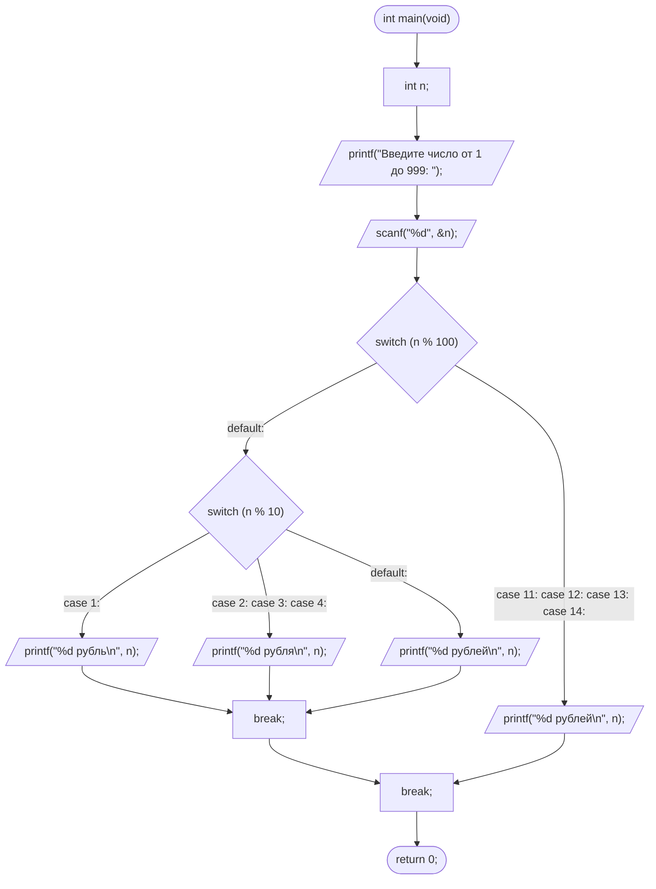

```mermaid
flowchart TD
    A(["int main(void)"]) --> B["int n;"]
    B --> C[/"printf(#quot;Введите число от 1 до 999: #quot;);"/]
    C --> D[/"scanf(#quot;%d#quot;, &amp;n);"/]
    D --> E{"switch (n % 100)"}
    E -->|"case 11: case 12: case 13: case 14:"| F[/"printf(#quot;%d рублей#92;n#quot;, n);"/]
    E -->|"default:"| G{"switch (n % 10)"}
    G -->|"case 1:"| H[/"printf(#quot;%d рубль#92;n#quot;, n);"/]
    G -->|"case 2: case 3: case 4:"| I[/"printf(#quot;%d рубля#92;n#quot;, n);"/]
    G -->|"default:"| J[/"printf(#quot;%d рублей#92;n#quot;, n);"/]
    H --> K["break;"]
    I --> K
    J --> K
    K --> L["break;"]
    F --> L
    L --> M(["return 0;"])
```
